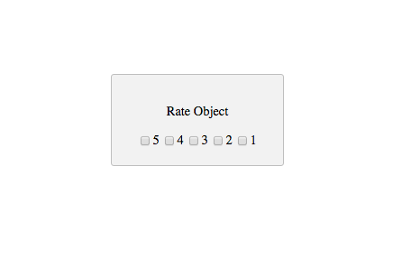

# starterTemplate-Rate-Object-API
a Javascript starter template for rating a custom object using the Stamplay Rest API

**NOTE: Users must be logged in to use the rating function!**

**CLONING: When cloning this repo, you must initialize your app to make it work.**

 1) **Initialize the front-end of your app with Stamplay**
 <br>
- Go to your command line and enter **stamplay init**
- When prompted, enter your **appID** & **API Key**

3) **Establish object to be rated**
- Go to your Stamplay editor and go to the **Data** section. Then go to **Objects**
- Establish which object in the collection your going to rate by getting it's **object Id**.

4) **Rate Object**
```

function rateFive(){

	var data = JSON.stringify({
  		"rate": 5
	});

	var xhr = new XMLHttpRequest();
	xhr.withCredentials = true;

	xhr.addEventListener("readystatechange", function () {
  		if (this.readyState === this.DONE) {
    		console.log(this.responseText);
  		}
	});

	xhr.open("PUT", "https://[yourAppId].stamplayapp.com/api/cobject/v1/cobjectId/:id/rate");
	xhr.setRequestHeader("accept", "application/json");
	xhr.setRequestHeader("content-type", "application/json");

	xhr.send(data);
}

```
5) **Run app**
- To run your app, you'll need to install the Stamplay Command Line Tool. If you have already installed it, ignore this step. Otherwise, enter this command in your command line:
```
$ npm install -g stamplay-cli
```
- If your app is in development, you can run it on your local server by entering **stamplay start** in your command line.
- If your app is in production, you can deploy it live by entering **stamplay deploy** in your command line.


